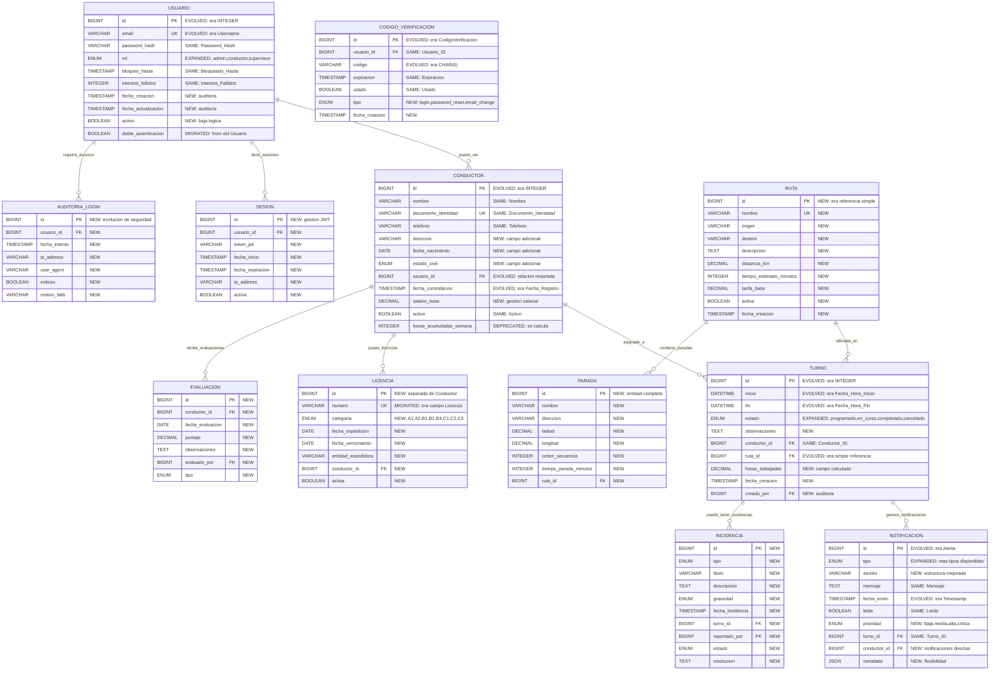

# Documentación Completa de Base de Datos - FleetGuard360

## Contexto del Proyecto
**Sprint 2 - Fábrica Escuela 2025-1**  
**Asignatura**: Arquitectura de Software - Universidad de Antioquia  
**Sistema**: FleetGuard360 - Gestión de Flotas de Transporte  
**Evolución**: Sprint 1 → Sprint 2 (Refinamiento y Expansión)

---

## Tabla de Contenido

1. [Evolución del Modelo: Sprint 1 → Sprint 2](#1-evolución-del-modelo-sprint-1--sprint-2)
2. [Modelo Entidad-Relación Refinado](#2-modelo-entidad-relación-refinado)
3. [Scripts de Migración y Evolución](#3-scripts-de-migración-y-evolución)
4. [Modelo Físico Completo Actualizado](#4-modelo-físico-completo-actualizado)
5. [Scripts de Despliegue Evolutivo](#5-scripts-de-despliegue-evolutivo)
6. [Consultas Optimizadas para Historias de Usuario](#6-consultas-optimizadas-para-historias-de-usuario)
7. [Análisis de Volumen de Datos](#7-análisis-de-volumen-de-datos)
8. [Roles y Esquema de Seguridad](#8-roles-y-esquema-de-seguridad)

---

## 1. Evolución del Modelo: Sprint 1 → Sprint 2

### 1.1 Análisis del Sprint 1 Existente

#### ✅ **Tablas Implementadas en Sprint 1:**
```sql
-- Estructura existente del Sprint 1
Conductor (ID, Nombre, Documento_Identidad, Email, Telefono, Licencia, 
           Horas_Acumuladas_Semana, Activo, Fecha_Registro)

Usuario (ID, Conductor_ID, Username, Password_Hash, Rol, Intentos_Fallidos, 
         Bloqueado_Hasta, Doble_Autenticacion, Fecha_Ultimo_Login)

CodigoVerificacion (ID, Usuario_ID, Codigo, Expiracion, Usado)

Turno (ID, Conductor_ID, Ruta_ID, Fecha_Hora_Inicio, Fecha_Hora_Fin, Estado)

Alerta (ID, Turno_ID, Tipo, Mensaje, Timestamp, Leida)
```

#### 🔄 **Cambios Requeridos para Sprint 2:**

##### **Normalización de Estructura:**
- **Separar tabla Usuario**: Independizar de Conductor para múltiples roles
- **Expandir Turno**: Agregar validaciones de 8h y campos de auditoría
- **Mejorar Alerta**: Convertir a sistema de Notificaciones más robusto
- **Agregar nuevas entidades**: RUTA, LICENCIA, INCIDENCIA, etc.

##### **Mejoras de Seguridad:**
- **Auditoría completa**: Nueva tabla AUDITORIA_LOGIN
- **Gestión de sesiones**: Nueva tabla SESION para JWT
- **Roles granulares**: Expandir más allá de Admin/Conductor

##### **Nuevas Funcionalidades:**
- **Sistema de rutas completo**: RUTA + PARADA
- **Gestión de licencias**: Separar de tabla Conductor
- **Sistema de evaluaciones**: Nueva tabla EVALUACION
- **Gestión de incidencias**: Nueva tabla INCIDENCIA

### 1.2 Plan de Migración Sprint 1 → Sprint 2

```sql
-- =====================================================
-- PLAN DE MIGRACIÓN: SPRINT 1 → SPRINT 2
-- =====================================================

-- Paso 1: Backup de datos existentes
CREATE TABLE conductor_backup AS SELECT * FROM conductor;
CREATE TABLE usuario_backup AS SELECT * FROM usuario;
CREATE TABLE turno_backup AS SELECT * FROM turno;
CREATE TABLE alerta_backup AS SELECT * FROM alerta;
CREATE TABLE codigoverificacion_backup AS SELECT * FROM codigoverificacion;

-- Paso 2: Crear nuevas tablas (sin afectar existentes)
-- Paso 3: Migrar datos con transformaciones
-- Paso 4: Actualizar referencias
-- Paso 5: Eliminar tablas obsoletas
-- Paso 6: Verificar integridad
```

---

## 2. Modelo Entidad-Relación Refinado

### 2.1 Diagrama E-R Evolutivo (Sprint 1 → Sprint 2)



### 2.2 Mapeo de Migración de Datos

#### **Tabla USUARIO (Evolucionada):**
```sql
-- Migración: Sprint 1 → Sprint 2
INSERT INTO usuario_new (
    email, password_hash, rol, bloqueo_hasta, intentos_fallidos, 
    doble_autenticacion, fecha_creacion, activo
)
SELECT 
    COALESCE(c.Email, CONCAT('user', u.ID, '@fleetguard360.temp')) as email,
    u.Password_Hash,
    CASE u.Rol 
        WHEN 'Admin' THEN 'admin'
        WHEN 'Conductor' THEN 'conductor'
        ELSE 'conductor'
    END as rol,
    u.Bloqueado_Hasta,
    u.Intentos_Fallidos,
    u.Doble_Autenticacion,
    COALESCE(c.Fecha_Registro, CURRENT_TIMESTAMP),
    TRUE
FROM usuario u
LEFT JOIN conductor c ON u.Conductor_ID = c.ID;
```

#### **Tabla CONDUCTOR (Refinada):**
```sql
-- Migración: Sprint 1 → Sprint 2
INSERT INTO conductor_new (
    nombre, documento_identidad, telefono, usuario_id, 
    fecha_contratacion, activo
)
SELECT 
    c.Nombre,
    c.Documento_Identidad,
    c.Telefono,
    u_new.id, -- Referencia al nuevo usuario
    c.Fecha_Registro,
    c.Activo
FROM conductor c
INNER JOIN usuario u_old ON c.ID = u_old.Conductor_ID
INNER JOIN usuario_new u_new ON u_old.Username = u_new.email;
```

#### **Tabla LICENCIA (Nueva - Datos Migrados):**
```sql
-- Migración: Extraer licencias de tabla Conductor
INSERT INTO licencia_new (
    numero, categoria, fecha_expedicion, fecha_vencimiento, 
    conductor_id, activa
)
SELECT 
    c.Licencia as numero,
    'B2' as categoria, -- Asumir categoría por defecto
    DATE_SUB(CURDATE(), INTERVAL 2 YEAR) as fecha_expedicion,
    DATE_ADD(CURDATE(), INTERVAL 3 YEAR) as fecha_vencimiento,
    c_new.id as conductor_id,
    c.Activo as activa
FROM conductor c
INNER JOIN conductor_new c_new ON c.Documento_Identidad = c_new.documento_identidad
WHERE c.Licencia IS NOT NULL AND c.Licencia != '';
```

---

## 3. Scripts de Migración y Evolución

### 3.1 Script Principal de Migración

```sql
-- =====================================================
-- SCRIPT DE MIGRACIÓN SPRINT 1 → SPRINT 2
-- FleetGuard360 - Evolución de Base de Datos
-- =====================================================

-- Configurar entorno de migración
SET FOREIGN_KEY_CHECKS = 0;
SET sql_mode = 'STRICT_TRANS_TABLES,ERROR_FOR_DIVISION_BY_ZERO,NO_AUTO_CREATE_USER,NO_ENGINE_SUBSTITUTION';

-- =====================================================
-- FASE 1: BACKUP Y VALIDACIÓN
-- =====================================================

-- Crear esquema de backup
CREATE SCHEMA IF NOT EXISTS fleetguard360_sprint1_backup;

-- Backup completo del Sprint 1
CREATE TABLE fleetguard360_sprint1_backup.conductor_backup AS 
SELECT * FROM conductor;

CREATE TABLE fleetguard360_sprint1_backup.usuario_backup AS 
SELECT * FROM usuario;

CREATE TABLE fleetguard360_sprint1_backup.turno_backup AS 
SELECT * FROM turno;

CREATE TABLE fleetguard360_sprint1_backup.alerta_backup AS 
SELECT * FROM alerta;

CREATE TABLE fleetguard360_sprint1_backup.codigoverificacion_backup AS 
SELECT * FROM codigoverificacion;

-- Validación de datos antes de migración
SELECT 
    'conductor' as tabla,
    COUNT(*) as registros,
    COUNT(CASE WHEN activo = true THEN 1 END) as activos
FROM conductor
UNION ALL
SELECT 
    'usuario' as tabla,
    COUNT(*) as registros,
    COUNT(CASE WHEN rol = 'Conductor' THEN 1 END) as conductores
FROM usuario
UNION ALL
SELECT 
    'turno' as tabla,
    COUNT(*) as registros,
    COUNT(CASE WHEN estado = 'Finalizado' THEN 1 END) as finalizados
FROM turno;

-- =====================================================
-- FASE 2: CREACIÓN DE NUEVAS ESTRUCTURAS
-- =====================================================

-- Crear tabla temporal para nuevos usuarios
CREATE TABLE usuario_sprint2 (
    id BIGINT AUTO_INCREMENT PRIMARY KEY,
    email VARCHAR(255) NOT NULL UNIQUE,
    password_hash VARCHAR(255) NOT NULL,
    rol ENUM('admin', 'conductor', 'supervisor') NOT NULL DEFAULT 'conductor',
    bloqueo_hasta TIMESTAMP NULL,
    intentos_fallidos INT NOT NULL DEFAULT 0,
    fecha_creacion TIMESTAMP DEFAULT CURRENT_TIMESTAMP,
    fecha_actualizacion TIMESTAMP DEFAULT CURRENT_TIMESTAMP ON UPDATE CURRENT_TIMESTAMP,
    activo BOOLEAN NOT NULL DEFAULT TRUE,
    doble_autenticacion BOOLEAN NOT NULL DEFAULT TRUE,
    
    INDEX idx_email (email),
    INDEX idx_rol (rol),
    INDEX idx_activo (activo)
);

-- Crear tabla temporal para nuevos conductores
CREATE TABLE conductor_sprint2 (
    id BIGINT AUTO_INCREMENT PRIMARY KEY,
    nombre VARCHAR(100) NOT NULL,
    documento_identidad VARCHAR(50) NOT NULL UNIQUE,
    telefono VARCHAR(20) NOT NULL,
    direccion VARCHAR(255),
    fecha_nacimiento DATE,
    estado_civil ENUM('soltero', 'casado', 'viudo', 'divorciado'),
    usuario_id BIGINT NOT NULL UNIQUE,
    fecha_contratacion TIMESTAMP DEFAULT CURRENT_TIMESTAMP,
    salario_base DECIMAL(10,2),
    activo BOOLEAN NOT NULL DEFAULT TRUE,
    
    INDEX idx_documento (documento_identidad),
    INDEX idx_telefono (telefono),
    INDEX idx_activo (activo),
    INDEX idx_usuario (usuario_id)
);

-- Crear tabla de licencias (nueva)
CREATE TABLE licencia_sprint2 (
    id BIGINT AUTO_INCREMENT PRIMARY KEY,
    numero VARCHAR(50) NOT NULL UNIQUE,
    categoria ENUM('A1', 'A2', 'B1', 'B2', 'B3', 'C1', 'C2', 'C3') NOT NULL,
    fecha_expedicion DATE NOT NULL,
    fecha_vencimiento DATE NOT NULL,
    entidad_expedidora VARCHAR(100),
    conductor_id BIGINT NOT NULL,
    activa BOOLEAN NOT NULL DEFAULT TRUE,
    
    INDEX idx_numero (numero),
    INDEX idx_vencimiento (fecha_vencimiento),
    INDEX idx_conductor (conductor_id),
    INDEX idx_activa (activa),
    
    CONSTRAINT chk_fechas_licencia CHECK (fecha_vencimiento > fecha_expedicion)
);

-- Crear tabla de rutas (nueva)
CREATE TABLE ruta_sprint2 (
    id BIGINT AUTO_INCREMENT PRIMARY KEY,
    nombre VARCHAR(100) NOT NULL UNIQUE,
    origen VARCHAR(255) NOT NULL,
    destino VARCHAR(255) NOT NULL,
    descripcion TEXT,
    distancia_km DECIMAL(8,2),
    tiempo_estimado_minutos INT,
    tarifa_base DECIMAL(8,2),
    activa BOOLEAN NOT NULL DEFAULT TRUE,
    fecha_creacion TIMESTAMP DEFAULT CURRENT_TIMESTAMP,
    
    INDEX idx_nombre (nombre),
    INDEX idx_activa (activa)
);

-- Crear tabla temporal para turnos evolucionados
CREATE TABLE turno_sprint2 (
    id BIGINT AUTO_INCREMENT PRIMARY KEY,
    inicio DATETIME NOT NULL,
    fin DATETIME NOT NULL,
    estado ENUM('programado', 'en_curso', 'completado', 'cancelado') NOT NULL DEFAULT 'programado',
    observaciones TEXT,
    conductor_id BIGINT NOT NULL,
    ruta_id BIGINT NOT NULL,
    horas_trabajadas DECIMAL(4,2) AS (TIMESTAMPDIFF(MINUTE, inicio, fin) / 60.0) STORED,
    fecha_creacion TIMESTAMP DEFAULT CURRENT_TIMESTAMP,
    creado_por BIGINT NOT NULL,
    
    INDEX idx_conductor (conductor_id),
    INDEX idx_ruta (ruta_id),
    INDEX idx_fechas (inicio, fin),
    INDEX idx_estado (estado),
    
    CONSTRAINT chk_fechas_turno CHECK (fin > inicio),
    CONSTRAINT chk_duracion_turno CHECK (TIMESTAMPDIFF(HOUR, inicio, fin) <= 8)
);

-- Crear tabla de notificaciones evolucionada
CREATE TABLE notificacion_sprint2 (
    id BIGINT AUTO_INCREMENT PRIMARY KEY,
    tipo ENUM('cambio_turno', 'alerta_velocidad', 'llegada_parada', 'vencimiento_licencia', 'incidencia') NOT NULL,
    asunto VARCHAR(255) NOT NULL,
    mensaje TEXT NOT NULL,
    fecha_envio TIMESTAMP DEFAULT CURRENT_TIMESTAMP,
    leida BOOLEAN NOT NULL DEFAULT FALSE,
    prioridad ENUM('baja', 'media', 'alta', 'critica') NOT NULL DEFAULT 'media',
    turno_id BIGINT,
    conductor_id BIGINT,
    metadata JSON,
    
    INDEX idx_tipo (tipo),
    INDEX idx_conductor (conductor_id),
    INDEX idx_turno (turno_id),
    INDEX idx_leida (leida),
    INDEX idx_prioridad (prioridad)
);

-- Crear tabla de códigos de verificación evolucionada
CREATE TABLE codigo_verificacion_sprint2 (
    id BIGINT AUTO_INCREMENT PRIMARY KEY,
    usuario_id BIGINT NOT NULL,
    codigo VARCHAR(10) NOT NULL,
    expiracion TIMESTAMP NOT NULL,
    usado BOOLEAN NOT NULL DEFAULT FALSE,
    tipo ENUM('login', 'password_reset', 'email_change') NOT NULL DEFAULT 'login',
    fecha_creacion TIMESTAMP DEFAULT CURRENT_TIMESTAMP,
    
    INDEX idx_usuario (usuario_id),
    INDEX idx_codigo (codigo),
    INDEX idx_expiracion (expiracion),
    INDEX idx_usado (usado)
);

-- =====================================================
-- FASE 3: MIGRACIÓN DE DATOS
-- =====================================================

-- 3.1 Migrar usuarios con lógica de consolidación
INSERT INTO usuario_sprint2 (
    email, password_hash, rol, bloqueo_hasta, intentos_fallidos, 
    doble_autenticacion, fecha_creacion, activo
)
SELECT 
    -- Priorizar email de conductor, sino generar uno temporal
    CASE 
        WHEN c.Email IS NOT NULL AND c.Email != '' THEN c.Email
        ELSE CONCAT('conductor_', c.Documento_Identidad, '@fleetguard360.temp')
    END as email,
    u.Password_Hash,
    CASE u.Rol 
        WHEN 'Admin' THEN 'admin'
        WHEN 'Conductor' THEN 'conductor'
        ELSE 'conductor'
    END as rol,
    u.Bloqueado_Hasta,
    u.Intentos_Fallidos,
    u.Doble_Autenticacion,
    COALESCE(c.Fecha_Registro, CURRENT_TIMESTAMP) as fecha_creacion,
    COALESCE(c.Activo, TRUE) as activo
FROM usuario u
LEFT JOIN conductor c ON u.Conductor_ID = c.ID;

-- 3.2 Migrar conductores con referencia a nuevos usuarios
INSERT INTO conductor_sprint2 (
    nombre, documento_identidad, telefono, usuario_id, 
    fecha_contratacion, activo
)
SELECT 
    c.Nombre,
    c.Documento_Identidad,
    COALESCE(c.Telefono, '0000000000') as telefono,
    u_new.id as usuario_id,
    c.Fecha_Registro as fecha_contratacion,
    c.Activo
FROM conductor c
INNER JOIN usuario u_old ON c.ID = u_old.Conductor_ID
INNER JOIN usuario_sprint2 u_new ON (
    (c.Email IS NOT NULL AND c.Email = u_new.email) OR
    (c.Email IS NULL AND u_new.email = CONCAT('conductor_', c.Documento_Identidad, '@fleetguard360.temp'))
);

-- 3.3 Crear rutas por defecto basadas en turnos existentes
INSERT INTO ruta_sprint2 (nombre, origen, destino, activa, fecha_creacion)
SELECT DISTINCT
    CONCAT('Ruta_', COALESCE(t.Ruta_ID, 1)) as nombre,
    'Origen por definir' as origen,
    'Destino por definir' as destino,
    TRUE as activa,
    MIN(t.Fecha_Hora_Inicio) as fecha_creacion
FROM turno t
WHERE t.Ruta_ID IS NOT NULL
GROUP BY t.Ruta_ID
UNION
SELECT 'Ruta General', 'Terminal Central', 'Zona General', TRUE, CURRENT_TIMESTAMP
WHERE NOT EXISTS (SELECT 1 FROM turno WHERE Ruta_ID IS NOT NULL);

-- 3.4 Migrar turnos con nuevas referencias
INSERT INTO turno_sprint2 (
    inicio, fin, estado, conductor_id, ruta_id, 
    fecha_creacion, creado_por, observaciones
)
SELECT 
    t.Fecha_Hora_Inicio as inicio,
    t.Fecha_Hora_Fin as fin,
    CASE t.Estado
        WHEN 'Planificado' THEN 'programado'
        WHEN 'EnCurso' THEN 'en_curso'
        WHEN 'Finalizado' THEN 'completado'
        WHEN 'Cancelado' THEN 'cancelado'
        ELSE 'programado'
    END as estado,
    c_new.id as conductor_id,
    COALESCE(r_new.id, 1) as ruta_id,
    CURRENT_TIMESTAMP as fecha_creacion,
    u_admin.id as creado_por,
    'Migrado desde Sprint 1' as observaciones
FROM turno t
INNER JOIN conductor c_old ON t.Conductor_ID = c_old.ID
INNER JOIN conductor_sprint2 c_new ON c_old.Documento_Identidad = c_new.documento_identidad
LEFT JOIN ruta_sprint2 r_new ON r_new.nombre = CONCAT('Ruta_', COALESCE(t.Ruta_ID, 1))
CROSS JOIN (
    SELECT id FROM usuario_sprint2 WHERE rol = 'admin' LIMIT 1
) u_admin;

-- 3.5 Migrar alertas a notificaciones
INSERT INTO notificacion_sprint2 (
    tipo, asunto, mensaje, fecha_envio, leida, 
    turno_id, prioridad
)
SELECT 
    CASE a.Tipo
        WHEN 'CambioTurno' THEN 'cambio_turno'
        WHEN 'JornadaExtendida' THEN 'incidencia'
        WHEN 'Incumplimiento' THEN 'incidencia'
        ELSE 'cambio_turno'
    END as tipo,
    CONCAT('[MIGRADO] ', a.Tipo) as asunto,
    a.Mensaje,
    a.Timestamp as fecha_envio,
    a.Leida,
    t_new.id as turno_id,
    CASE a.Tipo
        WHEN 'Incumplimiento' THEN 'alta'
        WHEN 'JornadaExtendida' THEN 'media'
        ELSE 'baja'
    END as prioridad
FROM alerta a
INNER JOIN turno t_old ON a.Turno_ID = t_old.ID
INNER JOIN turno_sprint2 t_new ON (
    t_old.Fecha_Hora_Inicio = t_new.inicio AND 
    t_old.Fecha_Hora_Fin = t_new.fin
);

-- 3.6 Migrar códigos de verificación
INSERT INTO codigo_verificacion_sprint2 (
    usuario_id, codigo, expiracion, usado, tipo, fecha_creacion
)
SELECT 
    u_new.id as usuario_id,
    cv.Codigo,
    cv.Expiracion,
    cv.Usado,
    'login' as tipo,
    CURRENT_TIMESTAMP as fecha_creacion
FROM codigoverificacion cv
INNER JOIN usuario u_old ON cv.Usuario_ID = u_old.ID
INNER JOIN conductor c ON u_old.Conductor_ID = c.ID
INNER JOIN usuario_sprint2 u_new ON (
    (c.Email IS NOT NULL AND c.Email = u_new.email) OR
    (c.Email IS NULL AND u_new.email = CONCAT('conductor_', c.Documento_Identidad, '@fleetguard360.temp'))
);

-- 3.7 Migrar licencias de conductores
INSERT INTO licencia_sprint2 (
    numero, categoria, fecha_expedicion, fecha_vencimiento, 
    conductor_id, activa, entidad_expedidora
)
SELECT 
    c.Licencia as numero,
    'B2' as categoria, -- Asumir categoría estándar
    DATE_SUB(CURDATE(), INTERVAL 2 YEAR) as fecha_expedicion,
    DATE_ADD(CURDATE(), INTERVAL 3 YEAR) as fecha_vencimiento,
    c_new.id as conductor_id,
    c.Activo as activa,
    'Ministerio de Transporte' as entidad_expedidora
FROM conductor c
INNER JOIN conductor_sprint2 c_new ON c.Documento_Identidad = c_new.documento_identidad
WHERE c.Licencia IS NOT NULL AND c.Licencia != '';

-- =====================================================
-- FASE 4: ACTUALIZACIÓN DE ESQUEMA
-- =====================================================

-- Agregar foreign keys a las nuevas tablas
ALTER TABLE conductor_sprint2 
ADD CONSTRAINT fk_conductor_usuario 
FOREIGN KEY (usuario_id) REFERENCES usuario_sprint2(id) ON DELETE CASCADE;

ALTER TABLE licencia_sprint2 
ADD CONSTRAINT fk_licencia_conductor 
FOREIGN KEY (conductor_id) REFERENCES conductor_sprint2(id) ON DELETE CASCADE;

ALTER TABLE turno_sprint2 
ADD CONSTRAINT fk_turno_conductor 
FOREIGN KEY (conductor_id) REFERENCES conductor_sprint2(id),
ADD CONSTRAINT fk_turno_ruta 
FOREIGN KEY (ruta_id) REFERENCES ruta_sprint2(id),
ADD CONSTRAINT fk_turno_creador 
FOREIGN KEY (creado_por) REFERENCES usuario_sprint2(id);

ALTER TABLE notificacion_sprint2 
ADD CONSTRAINT fk_notificacion_turno 
FOREIGN KEY (turno_id) REFERENCES turno_sprint2(id) ON DELETE CASCADE,
ADD CONSTRAINT fk_notificacion_conductor 
FOREIGN KEY (conductor_id) REFERENCES conductor_sprint2(id) ON DELETE CASCADE;

ALTER TABLE codigo_verificacion_sprint2 
ADD CONSTRAINT fk_codigo_usuario 
FOREIGN KEY (usuario_id) REFERENCES usuario_sprint2(id) ON DELETE CASCADE;

-- =====================================================
-- FASE 5: REEMPLAZAR TABLAS ORIGINALES
-- =====================================================

-- Renombrar tablas originales a _old
RENAME TABLE conductor TO conductor_sprint1_old;
RENAME TABLE usuario TO usuario_sprint1_old;
RENAME TABLE turno TO turno_sprint1_old;
RENAME TABLE alerta TO alerta_sprint1_old;
RENAME TABLE codigoverificacion TO codigoverificacion_sprint1_old;

-- Renombrar nuevas tablas a nombres finales
RENAME TABLE usuario_sprint2 TO usuario;
RENAME TABLE conductor_sprint2 TO conductor;
RENAME TABLE licencia_sprint2 TO licencia;
RENAME TABLE ruta_sprint2 TO ruta;
RENAME TABLE turno_sprint2 TO turno;
RENAME TABLE notificacion_sprint2 TO notificacion;
RENAME TABLE codigo_verificacion_sprint2 TO codigo_verificacion;

-- =====================================================
-- FASE 6: CREAR ENTIDADES ADICIONALES DEL SPRINT 2
-- =====================================================

-- Tabla de paradas para rutas
CREATE TABLE parada (
    id BIGINT AUTO_INCREMENT PRIMARY KEY,
    nombre VARCHAR(100) NOT NULL,
    direccion VARCHAR(255) NOT NULL,
    latitud DECIMAL(10,8),
    longitud DECIMAL(11,8),
    orden_secuencia INT NOT NULL,
    tiempo_parada_minutos INT NOT NULL DEFAULT 5,
    ruta_id BIGINT NOT NULL,
    
    FOREIGN KEY (ruta_id) REFERENCES ruta(id) ON DELETE CASCADE,
    
    UNIQUE KEY uk_ruta_orden (ruta_id, orden_secuencia),
    INDEX idx_ruta (ruta_id),
    INDEX idx_coordenadas (latitud, longitud)
);

-- Tabla de incidencias
CREATE TABLE incidencia (
    id BIGINT AUTO_INCREMENT PRIMARY KEY,
    tipo ENUM('retraso', 'accidente', 'vehiculo_danado', 'conducta_inadecuada', 'otros') NOT NULL,
    titulo VARCHAR(255) NOT NULL,
    descripcion TEXT NOT NULL,
    gravedad ENUM('leve', 'moderada', 'grave', 'critica') NOT NULL,
    fecha_incidencia TIMESTAMP NOT NULL,
    turno_id BIGINT NOT NULL,
    reportado_por BIGINT NOT NULL,
    estado ENUM('reportada', 'en_revision', 'resuelta', 'cerrada') NOT NULL DEFAULT 'reportada',
    resolucion TEXT,
    
    FOREIGN KEY (turno_id) REFERENCES turno(id),
    FOREIGN KEY (reportado_por) REFERENCES usuario(id),
    
    INDEX idx_tipo (tipo),
    INDEX idx_gravedad (gravedad),
    INDEX idx_turno (turno_id),
    INDEX idx_estado (estado),
    INDEX idx_fecha (fecha_incidencia)
);

-- Tabla de auditoría de login
CREATE TABLE auditoria_login (
    id BIGINT AUTO_INCREMENT PRIMARY KEY,
    usuario_id BIGINT NOT NULL,
    fecha_intento TIMESTAMP DEFAULT CURRENT_TIMESTAMP,
    ip_address VARCHAR(45),
    user_agent VARCHAR(500),
    exitoso BOOLEAN NOT NULL,
    motivo_fallo VARCHAR(255),
    
    FOREIGN KEY (usuario_id) REFERENCES usuario(id),
    
    INDEX idx_usuario (usuario_id),
    INDEX idx_fecha (fecha_intento),
    INDEX idx_exitoso (exitoso),
    INDEX idx_ip (ip_address)
);

-- Tabla de sesiones JWT
CREATE TABLE sesion (
    id BIGINT AUTO_INCREMENT PRIMARY KEY,
    usuario_id BIGINT NOT NULL,
    token_jwt VARCHAR(512) NOT NULL,
    fecha_inicio TIMESTAMP DEFAULT CURRENT_TIMESTAMP,
    fecha_expiracion TIMESTAMP NOT NULL,
    ip_address VARCHAR(45),
    activa BOOLEAN NOT NULL DEFAULT TRUE,
    
    FOREIGN KEY (usuario_id) REFERENCES usuario(id) ON DELETE CASCADE,
    
    UNIQUE KEY uk_token (token_jwt),
    INDEX idx_usuario (usuario_id),
    INDEX idx_expiracion (fecha_expiracion),
    INDEX idx_activa (activa)
);

-- Tabla de evaluaciones
CREATE TABLE evaluacion (
    id BIGINT AUTO_INCREMENT PRIMARY KEY,
    conductor_id BIGINT NOT NULL,
    fecha_evaluacion DATE NOT NULL,
    puntaje DECIMAL(3,2) NOT NULL,
    observaciones TEXT,
    evaluado_por BIGINT NOT NULL,
    tipo ENUM('mensual', 'semestral', 'anual', 'extraordinaria') NOT NULL,
    
    FOREIGN KEY (conductor_id) REFERENCES conductor(id),
    FOREIGN KEY (evaluado_por) REFERENCES usuario(id),
    
    INDEX idx_conductor (conductor_id),
    INDEX idx_fecha (fecha_evaluacion),
    INDEX idx_evaluador (evaluado_por),
    INDEX idx_tipo (tipo),
    
    CONSTRAINT chk_puntaje CHECK (puntaje >= 0 AND puntaje <= 10)
);

-- =====================================================
-- FASE 7: POBLAR DATOS INICIALES DEL SPRINT 2
-- =====================================================

-- Insertar paradas de ejemplo para rutas migradas
INSERT INTO parada (nombre, direccion, latitud, longitud, orden_secuencia, tiempo_parada_minutos, ruta_id)
SELECT 
    CONCAT(r.origen, ' - Terminal') as nombre,
    r.origen as direccion,
    6.2442000 + (RAND() * 0.1 - 0.05) as latitud,
    -75.5812000 + (RAND() * 0.1 - 0.05) as longitud,
    1 as orden_secuencia,
    10 as tiempo_parada_minutos,
    r.id
FROM ruta r
UNION ALL
SELECT 
    CONCAT(r.destino, ' - Terminal') as nombre,
    r.destino as direccion,
    6.2442000 + (RAND() * 0.1 - 0.05) as latitud,
    -75.5812000 + (RAND() * 0.1 - 0.05) as longitud,
    2 as orden_secuencia,
    10 as tiempo_parada_minutos,
    r.id
FROM ruta r;

-- Crear usuario administrador si no existe
INSERT IGNORE INTO usuario (email, password_hash, rol, activo, fecha_creacion)
VALUES ('admin@fleetguard360.com', '$2a$10$e0MYzXyjpJS7Pd0RVvHwHeFx5gkYgRyl8M/9Sx4GJyz49Fbi5Ce6G', 'admin', TRUE, NOW());

-- =====================================================
-- FASE 8: TRIGGERS Y PROCEDIMIENTOS ALMACENADOS
-- =====================================================

DELIMITER //

-- Trigger: Actualizar intentos fallidos en login
CREATE TRIGGER tr_usuario_login_fallido
    BEFORE UPDATE ON usuario
    FOR EACH ROW
BEGIN
    -- HU1: Bloquear usuario después de 5 intentos fallidos
    IF NEW.intentos_fallidos >= 5 AND OLD.intentos_fallidos < 5 THEN
        SET NEW.bloqueo_hasta = DATE_ADD(NOW(), INTERVAL 15 MINUTE);
    END IF;
    
    -- Resetear intentos si el bloqueo ha expirado
    IF NEW.bloqueo_hasta IS NOT NULL AND NEW.bloqueo_hasta < NOW() THEN
        SET NEW.intentos_fallidos = 0;
        SET NEW.bloqueo_hasta = NULL;
    END IF;
END//

-- Trigger: Validar solapamiento de turnos
CREATE TRIGGER tr_turno_solapamiento
    BEFORE INSERT ON turno
    FOR EACH ROW
BEGIN
    DECLARE solapamientos INT DEFAULT 0;
    
    -- HU5: Verificar solapamiento de turnos para el mismo conductor
    SELECT COUNT(*) INTO solapamientos
    FROM turno 
    WHERE conductor_id = NEW.conductor_id 
      AND estado IN ('programado', 'en_curso')
      AND (
          (NEW.inicio < fin AND NEW.fin > inicio)
      );
    
    IF solapamientos > 0 THEN
        SIGNAL SQLSTATE '45000' 
        SET MESSAGE_TEXT = 'ERROR: El conductor ya tiene un turno asignado en ese horario';
    END IF;
    
    -- HU5: Validar máximo 8 horas por turno
    IF TIMESTAMPDIFF(HOUR, NEW.inicio, NEW.fin) > 8 THEN
        SIGNAL SQLSTATE '45000' 
        SET MESSAGE_TEXT = 'ERROR: Un turno no puede exceder 8 horas de duración';
    END IF;
END//

-- Trigger: Notificación automática de vencimiento de licencia
CREATE TRIGGER tr_licencia_vencimiento
    AFTER INSERT ON licencia
    FOR EACH ROW
BEGIN
    -- Crear notificación si la licencia vence en 30 días
    IF NEW.fecha_vencimiento <= DATE_ADD(CURDATE(), INTERVAL 30 DAY) THEN
        INSERT INTO notificacion (
            tipo, asunto, mensaje, conductor_id, prioridad
        ) VALUES (
            'vencimiento_licencia',
            'Licencia próxima a vencer',
            CONCAT('La licencia ', NEW.numero, ' vence el ', NEW.fecha_vencimiento),
            NEW.conductor_id,
            'alta'
        );
    END IF;
END//

-- Procedimiento: Autenticación de usuario (HU1) - Mejorado
CREATE PROCEDURE sp_autenticar_usuario(
    IN p_email VARCHAR(255),
    IN p_password_hash VARCHAR(255),
    OUT p_usuario_id BIGINT,
    OUT p_resultado VARCHAR(50)
)
BEGIN
    DECLARE v_count INT DEFAULT 0;
    DECLARE v_intentos INT DEFAULT 0;
    DECLARE v_bloqueo TIMESTAMP;
    DECLARE v_activo BOOLEAN DEFAULT FALSE;
    
    -- Verificar si el usuario existe y está activo
    SELECT COUNT(*), intentos_fallidos, bloqueo_hasta, activo
    INTO v_count, v_intentos, v_bloqueo, v_activo
    FROM usuario 
    WHERE email = p_email;
    
    IF v_count = 0 THEN
        SET p_resultado = 'USUARIO_NO_EXISTE';
        SET p_usuario_id = NULL;
    ELSEIF NOT v_activo THEN
        SET p_resultado = 'USUARIO_INACTIVO';
        SET p_usuario_id = NULL;
    ELSEIF v_bloqueo IS NOT NULL AND v_bloqueo > NOW() THEN
        SET p_resultado = 'USUARIO_BLOQUEADO';
        SET p_usuario_id = NULL;
    ELSE
        -- Verificar contraseña
        SELECT id INTO p_usuario_id
        FROM usuario 
        WHERE email = p_email AND password_hash = p_password_hash;
        
        IF p_usuario_id IS NOT NULL THEN
            -- Login exitoso: resetear intentos
            UPDATE usuario 
            SET intentos_fallidos = 0, bloqueo_hasta = NULL 
            WHERE id = p_usuario_id;
            
            SET p_resultado = 'LOGIN_EXITOSO';
        ELSE
            -- Login fallido: incrementar intentos
            UPDATE usuario 
            SET intentos_fallidos = intentos_fallidos + 1 
            WHERE email = p_email;
            
            SET p_resultado = 'CREDENCIALES_INVALIDAS';
            SET p_usuario_id = NULL;
        END IF;
    END IF;
END//

DELIMITER ;

-- =====================================================
-- FASE 9: VERIFICACIÓN DE MIGRACIÓN
-- =====================================================

-- Restaurar configuraciones
SET FOREIGN_KEY_CHECKS = 1;

-- Procedimiento de verificación
DELIMITER //
CREATE PROCEDURE sp_verificar_migracion_sprint2()
BEGIN
    SELECT 'VERIFICACIÓN DE MIGRACIÓN SPRINT 1 → SPRINT 2' as titulo;
    
    -- Verificar conteos de registros migrados
    SELECT 
        'Usuarios migrados' as item,
        COUNT(*) as sprint2_actual,
        (SELECT COUNT(*) FROM usuario_sprint1_old) as sprint1_original,
        CASE 
            WHEN COUNT(*) >= (SELECT COUNT(*) FROM usuario_sprint1_old) THEN 'OK'
            ELSE 'ERROR'
        END as estado
    FROM usuario
    
    UNION ALL
    
    SELECT 
        'Conductores migrados' as item,
        COUNT(*) as sprint2_actual,
        (SELECT COUNT(*) FROM conductor_sprint1_old) as sprint1_original,
        CASE 
            WHEN COUNT(*) >= (SELECT COUNT(*) FROM conductor_sprint1_old) THEN 'OK'
            ELSE 'ERROR'
        END as estado
    FROM conductor
    
    UNION ALL
    
    SELECT 
        'Turnos migrados' as item,
        COUNT(*) as sprint2_actual,
        (SELECT COUNT(*) FROM turno_sprint1_old) as sprint1_original,
        CASE 
            WHEN COUNT(*) >= (SELECT COUNT(*) FROM turno_sprint1_old) THEN 'OK'
            ELSE 'ERROR'
        END as estado
    FROM turno
    
    UNION ALL
    
    SELECT 
        'Licencias creadas' as item,
        COUNT(*) as sprint2_actual,
        (SELECT COUNT(*) FROM conductor_sprint1_old WHERE Licencia IS NOT NULL AND Licencia != '') as sprint1_original,
        CASE 
            WHEN COUNT(*) >= (SELECT COUNT(*) FROM conductor_sprint1_old WHERE Licencia IS NOT NULL AND Licencia != '') THEN 'OK'
            ELSE 'ERROR'
        END as estado
    FROM licencia;
    
    -- Verificar integridad referencial
    SELECT 'VERIFICACIÓN DE INTEGRIDAD REFERENCIAL' as titulo;
    
    SELECT 
        'Conductores sin usuario' as problema,
        COUNT(*) as cantidad
    FROM conductor c 
    LEFT JOIN usuario u ON c.usuario_id = u.id 
    WHERE u.id IS NULL
    
    UNION ALL
    
    SELECT 
        'Turnos sin conductor' as problema,
        COUNT(*) as cantidad
    FROM turno t 
    LEFT JOIN conductor c ON t.conductor_id = c.id 
    WHERE c.id IS NULL
    
    UNION ALL
    
    SELECT 
        'Turnos sin ruta' as problema,
        COUNT(*) as cantidad
    FROM turno t 
    LEFT JOIN ruta r ON t.ruta_id = r.id 
    WHERE r.id IS NULL;
    
END//
DELIMITER ;

-- Ejecutar verificación
CALL sp_verificar_migracion_sprint2();

SELECT 'MIGRACIÓN SPRINT 1 → SPRINT 2 COMPLETADA' as resultado;
```

---

## 4. Modelo Físico Completo Actualizado

### 4.1 Comparativa de Estructuras: Sprint 1 vs Sprint 2

#### **Tabla USUARIO - Evolución:**

| Campo Sprint 1 | Campo Sprint 2 | Cambios |
|----------------|----------------|---------|
| ID (INTEGER) | id (BIGINT) | ✅ Tipo expandido |
| Username | email | ✅ Renombrado por claridad |
| Password_Hash | password_hash | ✅ Convención snake_case |
| Rol ('Admin','Conductor') | rol ('admin','conductor','supervisor') | ✅ Expandido + supervisor |
| Intentos_Fallidos | intentos_fallidos | ✅ Mismo concepto |
| Bloqueado_Hasta | bloqueo_hasta | ✅ Mismo concepto |
| Doble_Autenticacion | doble_autenticacion | ✅ Migrado |
| Fecha_Ultimo_Login | - | ❌ Removido (reemplazado por auditoría) |
| - | fecha_creacion | ✅ Nuevo: auditoría |
| - | fecha_actualizacion | ✅ Nuevo: auditoría |
| - | activo | ✅ Nuevo: baja lógica |

#### **Tabla CONDUCTOR - Evolución:**

| Campo Sprint 1 | Campo Sprint 2 | Cambios |
|----------------|----------------|---------|
| ID | id | ✅ Mismo concepto |
| Nombre | nombre | ✅ Mismo concepto |
| Documento_Identidad | documento_identidad | ✅ Mismo concepto |
| Email | - | ❌ Movido a tabla Usuario |
| Telefono | telefono | ✅ Mismo concepto |
| Licencia | - | ❌ Movido a tabla Licencia |
| Horas_Acumuladas_Semana | - | ❌ Se calcula dinámicamente |
| Activo | activo | ✅ Mismo concepto |
| Fecha_Registro | fecha_contratacion | ✅ Renombrado por claridad |
| - | direccion | ✅ Nuevo campo |
| - | fecha_nacimiento | ✅ Nuevo campo |
| - | estado_civil | ✅ Nuevo campo |
| - | usuario_id | ✅ Nueva relación |
| - | salario_base | ✅ Nuevo campo |

### 4.2 Nuevas Entidades del Sprint 2

#### **LICENCIA (Nueva - Datos migrados de Conductor.Licencia):**
```sql
-- Especificación técnica completa
CREATE TABLE licencia (
    id BIGINT AUTO_INCREMENT PRIMARY KEY,
    numero VARCHAR(50) NOT NULL UNIQUE,           -- Migrado de Conductor.Licencia
    categoria ENUM('A1','A2','B1','B2','B3','C1','C2','C3') NOT NULL,
    fecha_expedicion DATE NOT NULL,
    fecha_vencimiento DATE NOT NULL,
    entidad_expedidora VARCHAR(100),
    conductor_id BIGINT NOT NULL,
    activa BOOLEAN NOT NULL DEFAULT TRUE,
    
    -- Constraints y validaciones
    CONSTRAINT chk_fechas_licencia CHECK (fecha_vencimiento > fecha_expedicion),
    
    -- Índices optimizados
    INDEX idx_numero (numero),
    INDEX idx_vencimiento (fecha_vencimiento),
    INDEX idx_conductor (conductor_id),
    INDEX idx_activa (activa),
    
    -- Foreign keys
    FOREIGN KEY (conductor_id) REFERENCES conductor(id) ON DELETE CASCADE
);

-- Estimación de almacenamiento
-- Tamaño por registro: ~150 bytes
-- Registros esperados: 800 licencias (1 por conductor)
-- Total: 120 KB
```

#### **RUTA (Nueva - Evolucionada de Turno.Ruta_ID):**
```sql
CREATE TABLE ruta (
    id BIGINT AUTO_INCREMENT PRIMARY KEY,
    nombre VARCHAR(100) NOT NULL UNIQUE,
    origen VARCHAR(255) NOT NULL,
    destino VARCHAR(255) NOT NULL,
    descripcion TEXT,
    distancia_km DECIMAL(8,2),
    tiempo_estimado_minutos INT,
    tarifa_base DECIMAL(8,2),
    activa BOOLEAN NOT NULL DEFAULT TRUE,
    fecha_creacion TIMESTAMP DEFAULT CURRENT_TIMESTAMP,
    
    INDEX idx_nombre (nombre),
    INDEX idx_activa (activa),
    INDEX idx_origen (origen),
    INDEX idx_destino (destino)
);

-- Estimación de almacenamiento
-- Tamaño por registro: ~400 bytes
-- Registros esperados: 50 rutas
-- Total: 20 KB
```

### 4.3 Consultas de Compatibilidad con Sprint 1

```sql
-- =====================================================
-- VISTAS DE COMPATIBILIDAD SPRINT 1
-- Para mantener compatibilidad con código existente
-- =====================================================

-- Vista: Emular tabla Conductor del Sprint 1
CREATE VIEW conductor_sprint1_compatible AS
SELECT 
    c.id as ID,
    c.nombre as Nombre,
    c.documento_identidad as Documento_Identidad,
    u.email as Email,
    c.telefono as Telefono,
    COALESCE(l.numero, 'SIN_LICENCIA') as Licencia,
    COALESCE(
        (SELECT SUM(TIMESTAMPDIFF(HOUR, inicio, fin)) 
         FROM turno t 
         WHERE t.conductor_id = c.id 
           AND YEARWEEK(inicio) = YEARWEEK(NOW())
        ), 0
    ) as Horas_Acumuladas_Semana,
    c.activo as Activo,
    c.fecha_contratacion as Fecha_Registro
FROM conductor c
INNER JOIN usuario u ON c.usuario_id = u.id
LEFT JOIN licencia l ON c.id = l.conductor_id AND l.activa = TRUE;

-- Vista: Emular tabla Usuario del Sprint 1
CREATE VIEW usuario_sprint1_compatible AS
SELECT 
    u.id as ID,
    c.id as Conductor_ID,
    u.email as Username,
    u.password_hash as Password_Hash,
    CASE u.rol 
        WHEN 'admin' THEN 'Admin'
        WHEN 'conductor' THEN 'Conductor'
        WHEN 'supervisor' THEN 'Admin'
    END as Rol,
    u.intentos_fallidos as Intentos_Fallidos,
    u.bloqueo_hasta as Bloqueado_Hasta,
    u.doble_autenticacion as Doble_Autenticacion,
    (SELECT MAX(fecha_inicio) FROM sesion WHERE usuario_id = u.id) as Fecha_Ultimo_Login
FROM usuario u
LEFT JOIN conductor c ON u.id = c.usuario_id;

-- Vista: Emular tabla Turno del Sprint 1
CREATE VIEW turno_sprint1_compatible AS
SELECT 
    t.id as ID,
    t.conductor_id as Conductor_ID,
    t.ruta_id as Ruta_ID,
    t.inicio as Fecha_Hora_Inicio,
    t.fin as Fecha_Hora_Fin,
    CASE t.estado
        WHEN 'programado' THEN 'Planificado'
        WHEN 'en_curso' THEN 'EnCurso'
        WHEN 'completado' THEN 'Finalizado'
        WHEN 'cancelado' THEN 'Cancelado'
    END as Estado
FROM turno t;

-- Vista: Emular tabla Alerta del Sprint 1
CREATE VIEW alerta_sprint1_compatible AS
SELECT 
    n.id as ID,
    n.turno_id as Turno_ID,
    CASE n.tipo
        WHEN 'cambio_turno' THEN 'CambioTurno'
        WHEN 'incidencia' THEN 'JornadaExtendida'
        ELSE 'Incumplimiento'
    END as Tipo,
    n.mensaje as Mensaje,
    n.fecha_envio as Timestamp,
    n.leida as Leida
FROM notificacion n
WHERE n.turno_id IS NOT NULL;
```

---

## 5. Scripts de Despliegue Evolutivo

### 5.1 Script de Despliegue en Producción

```bash
#!/bin/bash
# =====================================================
# SCRIPT DE DESPLIEGUE EVOLUTIVO FLEETGUARD360
# Sprint 1 → Sprint 2
# =====================================================

# Variables de configuración
DB_HOST=${DB_HOST:-"localhost"}
DB_PORT=${DB_PORT:-"5432"}
DB_NAME=${DB_NAME:-"fleetguard360_db"}
DB_USER=${DB_USER:-"postgres"}
BACKUP_DIR="/backups/fleetguard360"
SCRIPTS_DIR="/deployment/scripts"

# Función de logging
log() {
    echo "[$(date '+%Y-%m-%d %H:%M:%S')] $1"
}

# Función de verificación de prerrequisitos
check_prerequisites() {
    log "Verificando prerrequisitos..."
    
    # Verificar conexión a BD
    psql -h $DB_HOST -p $DB_PORT -U $DB_USER -d $DB_NAME -c "SELECT 1;" > /dev/null 2>&1
    if [ $? -ne 0 ]; then
        log "ERROR: No se puede conectar a la base de datos"
        exit 1
    fi
    
    # Verificar que existe estructura Sprint 1
    TABLE_COUNT=$(psql -h $DB_HOST -p $DB_PORT -U $DB_USER -d $DB_NAME -t -c "SELECT COUNT(*) FROM information_schema.tables WHERE table_name IN ('conductor', 'usuario', 'turno');")
    if [ $TABLE_COUNT -lt 3 ]; then
        log "ERROR: No se encontró estructura del Sprint 1"
        exit 1
    fi
    
    log "Prerrequisitos verificados ✓"
}

# Función de backup
create_backup() {
    log "Creando backup del Sprint 1..."
    
    mkdir -p $BACKUP_DIR
    BACKUP_FILE="$BACKUP_DIR/fleetguard360_sprint1_backup_$(date +%Y%m%d_%H%M%S).sql"
    
    pg_dump -h $DB_HOST -p $DB_PORT -U $DB_USER $DB_NAME > $BACKUP_FILE
    
    if [ $? -eq 0 ]; then
        log "Backup creado exitosamente: $BACKUP_FILE"
        gzip $BACKUP_FILE
    else
        log "ERROR: Falló la creación del backup"
        exit 1
    fi
}

# Función de migración
execute_migration() {
    log "Ejecutando migración Sprint 1 → Sprint 2..."
    
    # Ejecutar script de migración
    psql -h $DB_HOST -p $DB_PORT -U $DB_USER -d $DB_NAME -f "$SCRIPTS_DIR/migration_sprint1_to_sprint2.sql"
    
    if [ $? -eq 0 ]; then
        log "Migración ejecutada exitosamente ✓"
    else
        log "ERROR: Falló la migración"
        exit 1
    fi
}

# Función de verificación post-migración
verify_migration() {
    log "Verificando migración..."
    
    # Ejecutar verificaciones
    psql -h $DB_HOST -p $DB_PORT -U $DB_USER -d $DB_NAME -c "CALL sp_verificar_migracion_sprint2();"
    
    if [ $? -eq 0 ]; then
        log "Verificación completada ✓"
    else
        log "WARNING: Verificación reportó problemas"
    fi
}

# Función principal
main() {
    log "=== INICIO DESPLIEGUE FLEETGUARD360 SPRINT 2 ==="
    
    check_prerequisites
    create_backup
    execute_migration
    verify_migration
    
    log "=== DESPLIEGUE COMPLETADO EXITOSAMENTE ==="
}

# Ejecutar despliegue
main "$@"
```

### 5.2 Script de Rollback (Si es necesario)

```bash
#!/bin/bash
# =====================================================
# SCRIPT DE ROLLBACK FLEETGUARD360
# Sprint 2 → Sprint 1
# =====================================================

# Variables
DB_HOST=${DB_HOST:-"localhost"}
DB_PORT=${DB_PORT:-"5432"}
DB_NAME=${DB_NAME:-"fleetguard360_db"}
DB_USER=${DB_USER:-"postgres"}
BACKUP_DIR="/backups/fleetguard360"

log() {
    echo "[$(date '+%Y-%m-%d %H:%M:%S')] ROLLBACK: $1"
}

execute_rollback() {
    log "Iniciando rollback a Sprint 1..."
    
    # Buscar backup más reciente del Sprint 1
    LATEST_BACKUP=$(ls -t $BACKUP_DIR/fleetguard360_sprint1_backup_*.sql.gz 2>/dev/null | head -1)
    
    if [ -z "$LATEST_BACKUP" ]; then
        log "ERROR: No se encontró backup del Sprint 1"
        exit 1
    fi
    
    log "Restaurando desde: $LATEST_BACKUP"
    
    # Confirmar rollback
    read -p "¿Confirma el rollback? (y/N): " -n 1 -r
    echo
    if [[ ! $REPLY =~ ^[Yy]$ ]]; then
        log "Rollback cancelado"
        exit 0
    fi
    
    # Restaurar backup
    gunzip -c $LATEST_BACKUP | psql -h $DB_HOST -p $DB_PORT -U $DB_USER $DB_NAME
    
    if [ $? -eq 0 ]; then
        log "Rollback completado exitosamente"
    else
        log "ERROR: Falló el rollback"
        exit 1
    fi
}

execute_rollback "$@"
```

---

## 6. Consultas Optimizadas para Historias de Usuario

### 6.1 HU1: Autenticación con Compatibilidad Sprint 1

```sql
-- Consulta mejorada: Login con email (Sprint 2) o username (Sprint 1)
SELECT 
    u.id,
    u.email,
    u.password_hash,
    u.rol,
    u.intentos_fallidos,
    u.bloqueo_hasta,
    u.activo,
    c.id as conductor_id,
    c.nombre as conductor_nombre,
    CASE 
        WHEN u.bloqueo_hasta IS NOT NULL AND u.bloqueo_hasta > NOW() THEN 'BLOQUEADO'
        WHEN u.intentos_fallidos >= 5 THEN 'BLOQUEADO_POR_INTENTOS'
        WHEN NOT u.activo THEN 'INACTIVO'
        ELSE 'DISPONIBLE'
    END AS estado_login
FROM usuario u
LEFT JOIN conductor c ON u.id = c.usuario_id
WHERE u.email = ? OR u.email = CONCAT('conductor_', ?, '@fleetguard360.temp');

-- Registrar intento de login (mejorado)
INSERT INTO auditoria_login (usuario_id, ip_address, user_agent, exitoso, motivo_fallo)
VALUES (?, ?, ?, ?, ?);
```

### 6.2 HU3: Registro de Conductores (Evolucionado)

```sql
-- Consulta: Crear conductor completo con validaciones Sprint 2
DELIMITER //
CREATE PROCEDURE sp_crear_conductor_completo(
    IN p_nombre VARCHAR(100),
    IN p_documento_identidad VARCHAR(50),
    IN p_telefono VARCHAR(20),
    IN p_email VARCHAR(255),
    IN p_password_hash VARCHAR(255),
    IN p_numero_licencia VARCHAR(50),
    IN p_categoria_licencia ENUM('A1','A2','B1','B2','B3','C1','C2','C3'),
    OUT p_conductor_id BIGINT,
    OUT p_resultado VARCHAR(100)
)
BEGIN
    DECLARE v_usuario_id BIGINT;
    DECLARE v_licencia_id BIGINT;