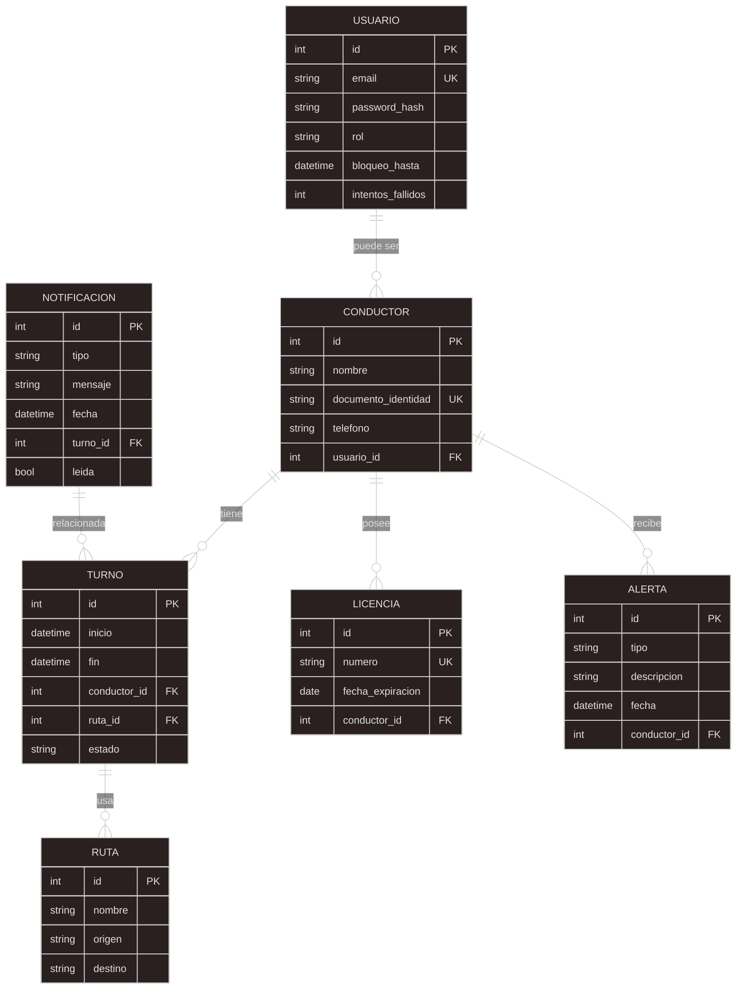
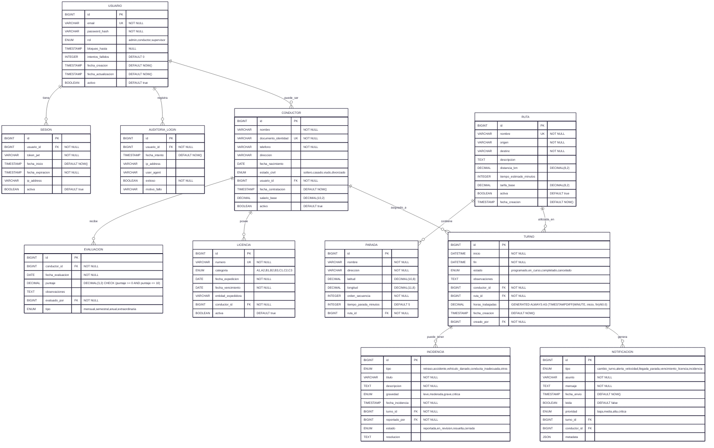

# Fleetguard feature 1 Database
### Descripción 
# Script SQL para FleetGuard360

Este archivo contiene el esquema de la base de PostgreSQL para la Feature 1 (Gestión de Conductores).

## Tablas principales
- `Conductor`: Datos de conductores.
- `Usuario`: Credenciales y autenticación.
- `Turno`: Asignación de jornadas.

## Ejecución
```bash
psql -U tu_usuario -d tu_basedatos -f fleetguard360_schema.sql
```

#### Esta seccion del repositorio está realizado por el quipo de bases de datos del proyecto fleetguard, para el codefactory20251-feqature1
#### está compuesto por el diagrama E-R y los script de generación y manipulación en postgreesql
 

## Diagrama E-R




## Actualizacion diagrama MER


