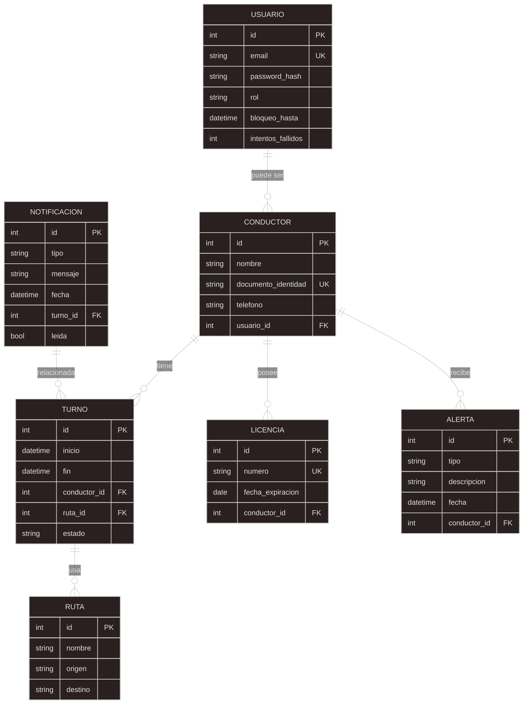

# Database
#### Esta seccion del repositorio está realizado por el quipo de bases de datos del proyecto fleetguard, para el codefactory20251-feqature1
#### está compuesto por el diagrama E-R y los script de generación y manipulación en postgreesql
 

## Diagrama E-R

